#  Tajweed Mushaf Comparison

## Overview

This project compares **Tajweed color-coding systems** used in different printed Qurans.
These systems help readers identify Tajweed rules while reciting the Quran.

The repository focuses on **two main types of Tajweed Mushaf styles**:

1. [**Dar Al-Ma‘rifah Tajweed Mushaf**](https://dn720003.ca.archive.org/0/items/bensaoud_gmail_20170308_0721/%D9%85%D8%B5%D8%AD%D9%81%20%D8%A7%D9%84%D8%AA%D8%AC%D9%88%D9%8A%D8%AF%20%D8%A7%D9%84%D9%85%D9%84%D9%88%D9%86.pdf)
2. [**Indo-Pak Tajweed Mushaf**](https://www.irfan-ul-quran.com/english/tid/59334/Download-the-16-Line-Color-Coded-Tajweed-Quran-PDF-Para-1-to-30.html?utm_source=chatgpt.com)

The goal is to understand how each system highlights Tajweed rules visually.

---

#  Mushaf Types

## 1 Dar Al-Ma‘rifah Tajweed Mushaf

**Publisher:** Dar Al-Ma‘rifah (Syria)
**Script:** Uthmani script
**Pages:** 604
**Coloring Method:** **Rule-letter coloring**

### Coloring Method

In this Mushaf, the **letter that carries the Tajweed rule** is colored.

Characteristics:

* The specific **letter where the rule occurs is colored**
* The following letter is usually left in its normal color
* Special symbols may be used for some rules (for example, a small meem for Iqlab)

Example:

Ikhfa
**مِنْ شَرٍّ**

The color is applied to:

* The **noon sakinah** only

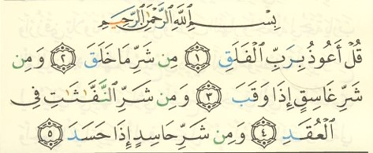

This approach focuses on **identifying the rule location in the text**.

---

## 2 Indo-Pak Tajweed Mushaf

**Script:** Indo-Pak script
**Common in:** Pakistan, India, Bangladesh

**Coloring Method:** **Phonetic coloring**

### Coloring Method

This system focuses on **how the rule sounds during recitation**, not just the letter.

Therefore, coloring may include:

* The letter itself
* The nasal sound (ghunnah)
* Part of the following letter

Example:

Ikhfa
**مِنْ شَرٍّ**

The coloring may appear on:

* The noon
* Part of the following letter

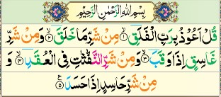

This helps emphasize the **pronunciation and sound effect** of the Tajweed rule.

---

#  Tajweed Coloring Classification

The Tajweed Mushafs in this project are categorized into two types:

| Type                 | Description                                            |
| -------------------- | ------------------------------------------------------ |
| rule_letter_coloring | Colors the letter where the Tajweed rule occurs        |
| phonetic_coloring    | Colors the sound or pronunciation produced by the rule |

---

#  Tajweed Rules Compared

Examples from both Mushafs are provided for different Tajweed rules.

---

## 1 Noon Sakinah and Tanween Rules

Includes:

* Izhar
* Idgham
* Iqlab
* Ikhfa

---

### Izhar

Example: **مِنْ آيَةٍ**

**Dar Al-Ma‘rifah**

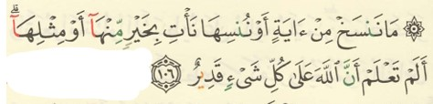

**Indo-Pak**

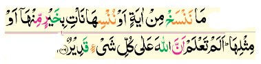
---

### Idgham

Example: **مِن رَّبِّهِم**

**Dar Al-Ma‘rifah**

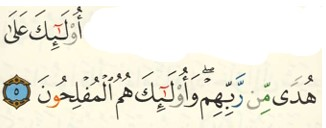

**Indo-Pak**

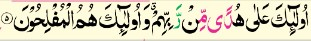

---

### Iqlab

Example: **مِن بَعْدِ**

**Dar Al-Ma‘rifah**

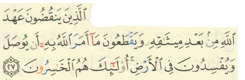

**Indo-Pak**

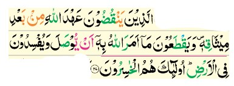
---

### Ikhfa

Example: **مِنْ شَرٍّ**

**Dar Al-Ma‘rifah**

**Indo-Pak**

---

## 2 Meem Sakinah Rules

Includes:

* Ikhfa Shafawi
* Idgham Shafawi
* Izhar Shafawi

Example:

**لَهُم مَّا**

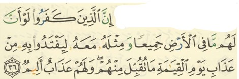

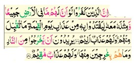

---

## 3 Madd Rules

Includes:

* Madd Tabee‘i (Natural Madd)
* Madd Muttasil
* Madd Munfasil
* Madd Lazim
* Madd Arid Lissukun
* Madd Badal

Example:

**قَالُوا**

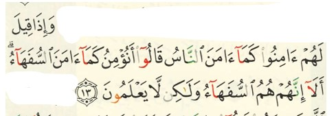

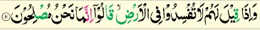

---

## 4 Qalqalah

Example:

**أَجْرٌ**

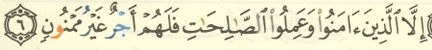

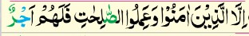

---

## 5 Tafkhim and Tarqiq

Includes:

* Heavy letters (Tafkhim)
* Light letters (Tarqiq)
* Lam in the name of Allah
* Rules of the letter Ra

Images are available in:

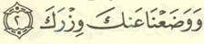

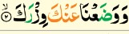

---

#  Summary of Differences

| Feature          | Dar Al-Ma‘rifah      | Indo-Pak                |
| ---------------- | -------------------- | ----------------------- |
| Coloring Type    | Rule-letter coloring | Phonetic coloring       |
| Script           | Uthmani              | Indo-Pak                |
| Ghunnah emphasis | Moderate             | Strong                  |
| Main Purpose     | Identify the rule    | Emphasize pronunciation |
